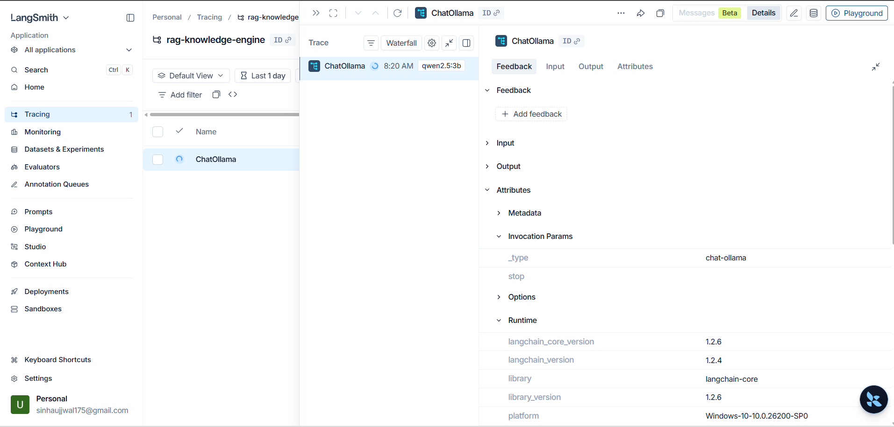

<!-- # AI Knowledge Search Engine

A RAG-based app for uploading documents, searching semantically, and chatting with content using local LLMs.

<p align="center">
  
</p>

[](https://www.python.org)
[](https://www.docker.com)
[](https://opensource.org/licenses/MIT)

## Features
- Document upload (PDF, DOCX, TXT)
- Hybrid search (vector + BM25 + reranking)
- Local LLM integration (Ollama with llama3.2)
- User authentication and isolation
- React frontend with real-time chat
- Dockerized setup

## Tech Stack
- Backend: FastAPI, SQLAlchemy, ChromaDB, LangChain
- Frontend: React
- Database: MySQL
- LLM: Ollama
- Docker for deployment

## Quick Start
1. Clone repo: `git clone https://github.com/yourusername/repo.git`
2. Start with Docker: `docker compose up --build`
3. Access frontend: http://localhost
4. API: http://localhost:8000/docs


## Structure
.
├── backend/          # FastAPI server
│   ├── api/          # Endpoints (chat, auth, etc.)
│   ├── rag/          # RAG pipeline
│   ├── utils/        # Helpers
│   ├── db/           # Database models
│   └── main.py       # Entry point
├── frontend/         # React app
├── docker-compose.yml  # Multi-container setup
└── README.md         # This file


## Setup .env
Create .env in root:

## Contributing
See CONTRIBUTING.md

## License
MIT -->

# 🧠 AI Knowledge Search Engine

A production-grade RAG system for uploading documents and chatting with content using local LLMs. Features hybrid retrieval, agentic tool-calling, multi-turn memory, and LangSmith observability.

<p align="center">
  
</p>

[](https://www.python.org)
[](https://fastapi.tiangolo.com)
[](https://www.docker.com)
[](https://langchain.com)
[](https://opensource.org/licenses/MIT)

---

## ✨ Features

- **Hybrid Retrieval** — Vector Search + BM25 keyword matching, narrowing 120 candidates to top 6
- **Cross-Encoder Reranking** — BAAI/bge-reranker-v2-m3 for maximum relevance scoring
- **Agentic Tool-Calling** — LLM decides when to search, summarize, or extract
- **Multi-turn Memory** — Session-based conversation history across follow-up queries
- **Document Support** — PDF, DOCX, TXT ingestion with per-user vector isolation
- **Streaming Responses** — Real-time token streaming with source citations
- **LangSmith Observability** — End-to-end chain tracing and latency monitoring
- **Dockerized** — 4-service architecture (FastAPI, MySQL, Ollama, React)

---

## 📊 RAGAs Evaluation Results

Evaluated on 15 domain-specific questions using Llama-3.3-70b as judge.

| Metric | Score |
|---|---|
| Faithfulness | 0.84 |
| Answer Relevancy | 0.91 |
| Context Precision | 0.86 |
| Context Recall | 0.90 |

---

## 🔍 Observability

Integrated LangSmith for end-to-end LLM call tracing, tool-use monitoring, and retrieval quality analysis.

<!-- Add your LangSmith screenshot here -->
<p align="center">
  
</p>

---

## 🏗️ Architecture

User Query
│
▼
FastAPI Backend
│
├── Query Analysis (LLM)
│
├── Hybrid Retrieval
│     ├── Vector Search (ChromaDB)
│     └── BM25 Keyword Search
│
├── Cross-Encoder Reranking
│
├── Agentic Tool-Calling
│     ├── rag_search
│     ├── rag_summarize
│     └── rag_extract
│
└── Streaming Response → React UI


---

## 🛠️ Tech Stack

| Layer | Technology |
|---|---|
| Backend | FastAPI, LangChain, SQLAlchemy |
| Vector DB | ChromaDB |
| Embeddings | sentence-transformers/all-MiniLM-L6-v2 |
| Reranker | BAAI/bge-reranker-v2-m3 |
| LLM | Ollama (qwen2.5:3b) |
| Frontend | React, Tailwind CSS |
| Database | MySQL |
| Observability | LangSmith |
| Deployment | Docker |

---

## 🚀 Quick Start

1. Clone repo:
```bash
git clone https://github.com/yourusername/ai-knowledge-search-engine.git
cd ai-knowledge-search-engine
```

2. Create `.env` in root:

OLLAMA_MODEL=qwen2.5:3b
LANGCHAIN_TRACING_V2=true
LANGCHAIN_API_KEY=your_key
LANGCHAIN_PROJECT=rag-knowledge-engine


3. Start with Docker:
```bash
docker compose up --build
```

4. Access:
- Frontend: http://localhost
- API Docs: http://localhost:8000/docs

---

## 📁 Structure

.
├── backend/
│   ├── api/          # Chat, auth, document endpoints
│   ├── rag/          # Ingestion pipeline
│   ├── db/           # MySQL models
│   └── main.py
├── frontend/         # React app
├── evaluate.py       # RAGAs evaluation script
├── docker-compose.yml
└── README.md

---

## 📄 License
MIT